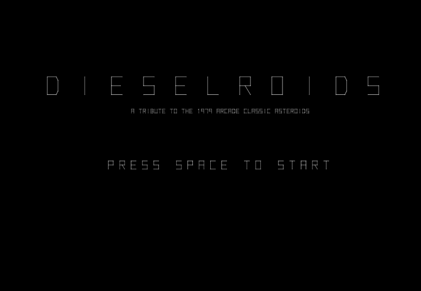

# 🚀 DIESELROIDS: A Tribute to the 1979 Arcade Classic

## 🕹️ Play Now!
**Play the game instantly in your browser:**
[https://dieselinc.github.io/dieselroids/](https://dieselinc.github.io/dieselroids/)

---

### 🌟 About DIESELROIDS
A faithful, 100% browser-based tribute to the legendary 1979 vector arcade game, ASTEROIDS.

**The promise:** No microtransactions. No ads. Just pure, unfiltered vector arcade action.

### ⚙️ Controls
| Action | Desktop Key | Mobile Control |
| :--- | :--- | :--- |
| **Rotate Left** | Left Arrow (←) | Left Side Button (◄) |
| **Rotate Right** | Right Arrow (→) | Right Side Button (►) |
| **Thrust** | Up Arrow (↑) | Center Right Button (▲) |
| **Brake** | Down Arrow (↓) | (None) |
| **Fire Laser** | Spacebar | Left Button (● FIRE) |
| **Hyperspace** | SHIFT | Center Left Button (⚡ HYPER) |

---

### 🛠️ Technical Notes
* **Built with:** HTML5 Canvas & Web Audio API
* **Style:** Authentic 1px vector line rendering
* **Audio:** Procedurally synthesized sound effects (Laser, Explosion, Thrust, UFO)
* **Open Source:** View the source code [here](https://github.com/dieselinc/dieselroids).

---
*(A 2025 project by DIESEL INC.)*